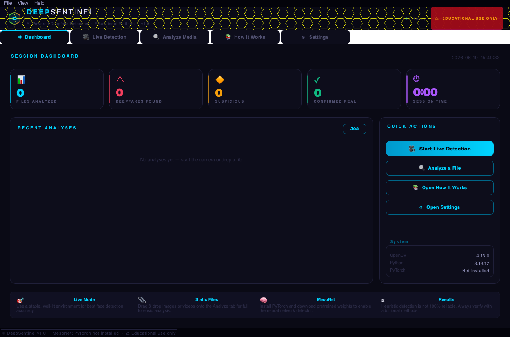
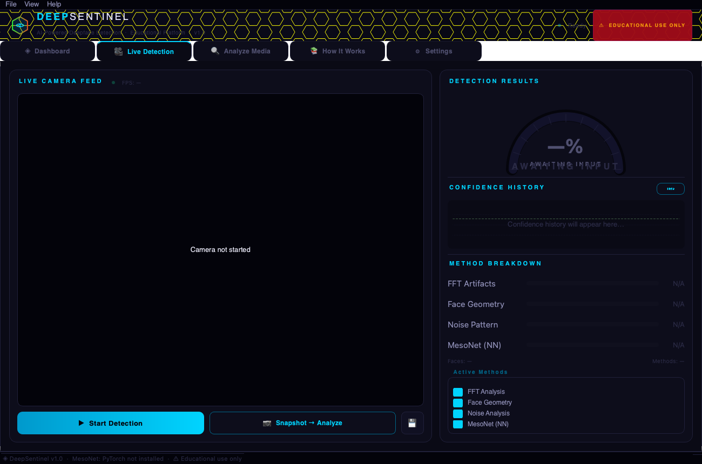
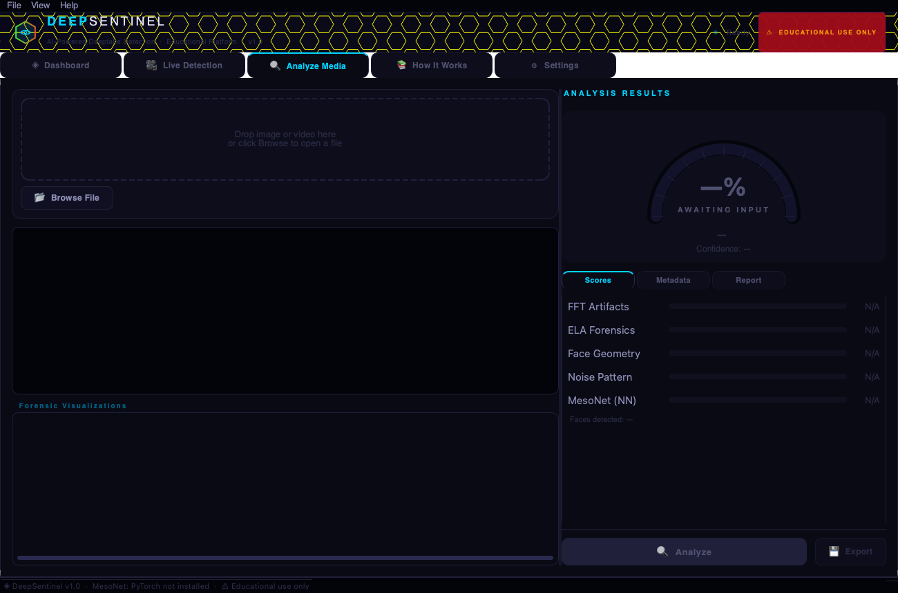
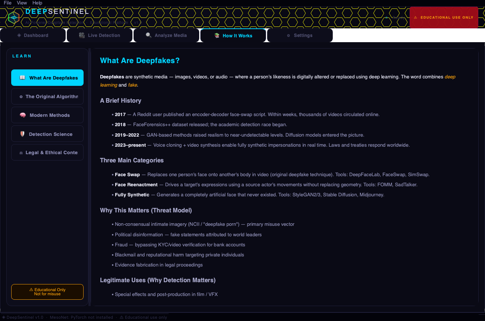
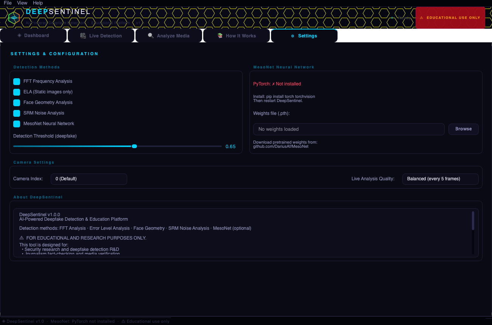

<div align="center">

```
██████╗ ███████╗███████╗██████╗
██╔══██╗██╔════╝██╔════╝██╔══██╗
██║  ██║█████╗  █████╗  ██████╔╝
██║  ██║██╔══╝  ██╔══╝  ██╔═══╝
██████╔╝███████╗███████╗██║
╚═════╝ ╚══════╝╚══════╝╚═╝
███████╗███████╗███╗   ██╗████████╗██╗███╗   ██╗███████╗██╗
██╔════╝██╔════╝████╗  ██║╚══██╔══╝██║████╗  ██║██╔════╝██║
███████╗█████╗  ██╔██╗ ██║   ██║   ██║██╔██╗ ██║█████╗  ██║
╚════██║██╔══╝  ██║╚██╗██║   ██║   ██║██║╚██╗██║██╔══╝  ██║
███████║███████╗██║ ╚████║   ██║   ██║██║ ╚████║███████╗███████╗
╚══════╝╚══════╝╚═╝  ╚═══╝   ╚═╝   ╚═╝╚═╝  ╚═══╝╚══════╝╚══════╝
```

# ◈ DEEPSENTINEL

### AI-Powered Deepfake Detection & Education Platform


> ⚠️ **EDUCATIONAL AND RESEARCH USE ONLY** — This tool is designed for cybersecurity education, digital forensics research, and media verification. Creating non-consensual deepfakes is illegal in many jurisdictions.

</div>

---

## ✦ Screenshots

<table>
<tr>
<td width="50%">

<p align="center"><b>Session Dashboard</b> — Live stats, analysis history, quick actions</p>
</td>
<td width="50%">

<p align="center"><b>Live Detection</b> — Real-time webcam analysis with arc gauge + history graph</p>
</td>
</tr>
<tr>
<td width="50%">

<p align="center"><b>Analyze Media</b> — Drag-and-drop static image/video forensics + EXIF panel</p>
</td>
<td width="50%">

<p align="center"><b>How It Works</b> — Interactive education with the original algorithm explained</p>
</td>
</tr>
</table>

<div align="center">

<p><b>Settings</b> — Configure detection methods, MesoNet weights, and camera</p>
</div>

---

## ✦ Features

### 🎥 Live Webcam Detection
- Real-time face detection on webcam feed using OpenCV Haar cascades
- **Animated arc confidence gauge** with smooth ease-out animation
- **Live confidence history graph** — scrolling time-series painted with QPainter
- Per-method score breakdown updated every frame
- **Snapshot → Analyze** — freeze any frame and send directly to full forensic analysis
- Start/Stop + Save frame button

### 🔍 Static Media Analysis
- Drag-and-drop or browse for **images and videos** (PNG, JPG, WEBP, TIFF, MP4, MOV, AVI…)
- Full multi-method analysis pipeline with **progress tracking**
- Forensic visualization strip — FFT spectrum, ELA map, noise residual heatmap, face overlay
- **EXIF metadata panel** with automatic flag detection (AI software hints, missing camera data)
- Detailed **text report** with all scores and interpretation — exportable to `.txt`
- Video analysis: samples 20 frames, averages + peak-weights for final verdict

### ◈ Session Dashboard
- Live session statistics: Files Analyzed, Deepfakes Found, Suspicious, Confirmed Real
- Elapsed session timer
- **Recent Analyses history** with timestamps, filenames, verdicts, and scores
- Quick-action buttons to jump between tabs
- System info panel (OpenCV version, PyTorch status, MPS availability)

### 📚 How It Works (Education)
Five richly illustrated sections covering:
1. **What Are Deepfakes?** — history, categories, threat model
2. **The Original Algorithm** — 2017 autoencoder with simplified PyTorch code
3. **Modern Methods** — GANs, diffusion, real-time tools
4. **Detection Science** — how each method works, with ASCII diagrams
5. **Legal & Ethical Context** — legislation, researcher principles, resources

---

## ✦ Detection Methods

| Method | Type | Speed | Notes |
|---|---|---|---|
| **FFT Frequency Analysis** | Signal / forensic | Fast | Detects GAN upsampling checkerboard artifacts in frequency domain |
| **Error Level Analysis** | Signal / forensic | Medium | JPEG re-compression inconsistency; best on low-quality fakes |
| **Face Geometry** | Biometric | Fast | Haar cascade + eye placement vs. anthropometric distributions |
| **SRM Noise Analysis** | Signal / forensic | Medium | Sensor noise statistics; flags over-smooth or periodic-structured noise |
| **MesoNet (NN)** | Neural network | Fast (GPU) | 156K-param CNN from Afchar et al. 2018; optional — needs PyTorch + weights |

Scores from active methods are combined via **weighted ensemble** (configurable in Settings).

> **Accuracy note:** Heuristic methods achieve ~65–75% on moderate-quality deepfakes. State-of-the-art 2024 diffusion output can evade all current public detectors. Always corroborate findings.

---

## ✦ Installation

### Requirements
- Python 3.11+
- macOS, Linux, or Windows

### Install Dependencies

```bash
git clone https://github.com/at0m-b0mb/DeepSentinel.git
cd DeepSentinel
pip install -r requirements.txt
```

### Optional: MesoNet Neural Network
```bash
# Install PyTorch (Apple Silicon)
pip install torch torchvision

# Or for CUDA GPU:
pip install torch torchvision --index-url https://download.pytorch.org/whl/cu121

# Download pretrained weights from the MesoNet repository:
# https://github.com/DariusAf/MesoNet
# Place the .pth file anywhere and load via Settings → MesoNet → Browse
```

### Run

```bash
python main.py
```

---

## ✦ Project Structure

```
DeepSentinel/
├── main.py                          # Entry point
├── requirements.txt
│
├── src/
│   ├── detection/
│   │   ├── detector.py              # Orchestrator — runs all methods, ensembles scores
│   │   ├── frequency_analysis.py    # FFT artifact + ELA forensics
│   │   ├── face_analyzer.py         # Haar cascade face detection + geometry checks
│   │   ├── noise_analyzer.py        # SRM high-pass filter noise residual analysis
│   │   ├── mesonet.py               # MesoNet Meso4 architecture (PyTorch, optional)
│   │   └── metadata.py              # EXIF extraction + AI-software flag detection
│   │
│   ├── education/
│   │   └── pipeline.py              # HTML content for the How It Works tab
│   │
│   └── gui/
│       ├── theme.py                 # Full dark cyberpunk QSS stylesheet + palette
│       ├── widgets.py               # Custom painted widgets: ConfidenceDial, HistoryGraph,
│       │                            #   GlowScoreBar, StatCard, PulsingDot, HistoryRow
│       ├── main_window.py           # Main window: animated HexLogo, HeaderWidget, tabs
│       ├── dashboard_tab.py         # Session stats, history list, quick actions
│       ├── live_tab.py              # Webcam feed + CameraWorker QThread
│       ├── analyze_tab.py           # Static analysis + EXIF + forensic viz strip
│       ├── education_tab.py         # Sidebar nav + QTextBrowser content + code panel
│       └── settings_tab.py          # Detection toggles, thresholds, MesoNet loader
│
└── assets/
    └── screenshots/                 # GUI screenshots used in README
```

---

## ✦ How the Detection Works

```
Image / Video Frame
        │
        ├──▶  FFT Analysis      ──▶  kurtosis + periodicity score
        ├──▶  ELA               ──▶  JPEG re-compression mismatch score
        ├──▶  Face Geometry     ──▶  boundary artifact + eye placement score
        ├──▶  SRM Noise         ──▶  noise residual kurtosis score
        └──▶  MesoNet (opt.)   ──▶  CNN classification probability
                │
                ▼
        Weighted Ensemble
                │
                ▼
        ┌───────────────────────────────────┐
        │  Score < 0.40  ──▶  REAL          │
        │  0.40 – 0.65   ──▶  SUSPICIOUS    │
        │  Score > 0.65  ──▶  DEEPFAKE      │
        └───────────────────────────────────┘
```

---

## ✦ Ethics & Legal Notice

This project is intended **exclusively** for:
- Security research and deepfake detection R&D
- Journalism fact-checking and media verification
- Education about synthetic media risks
- Digital forensics and legal evidence analysis

**Creating non-consensual deepfakes is illegal** under the UK Online Safety Act 2023, US DEFIANCE Act 2024, EU AI Act 2024, and many other jurisdictions. Violations may result in criminal prosecution, civil liability, and significant fines.

By using DeepSentinel you confirm you will act ethically, legally, and within the scope of legitimate research or defensive security.

---

## ✦ References

- Afchar et al. (2018) — *MesoNet: a Compact Facial Video Forgery Detection Network* ([arXiv:1809.00888](https://arxiv.org/abs/1809.00888))
- Rössler et al. (2019) — *FaceForensics++: Learning to Detect Manipulated Facial Images* ([arXiv:1901.08971](https://arxiv.org/abs/1901.08971))
- Fridrich & Kodovský (2012) — *Rich Models for Steganalysis of Digital Images*
- Li et al. (2020) — *SimSwap: An Efficient Framework For High Fidelity Face Swapping*

---

<div align="center">

Made by **[at0m-b0mb](https://github.com/at0m-b0mb)** · For educational and research use only

</div>
