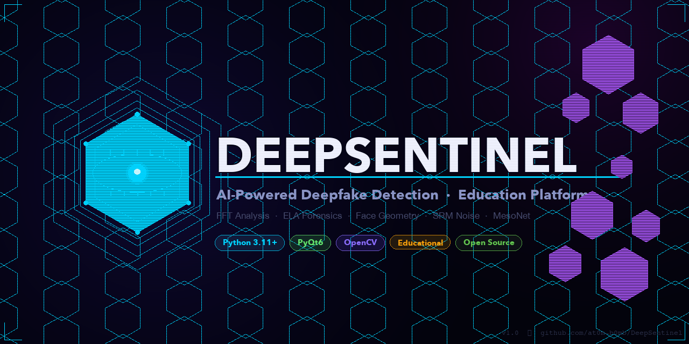
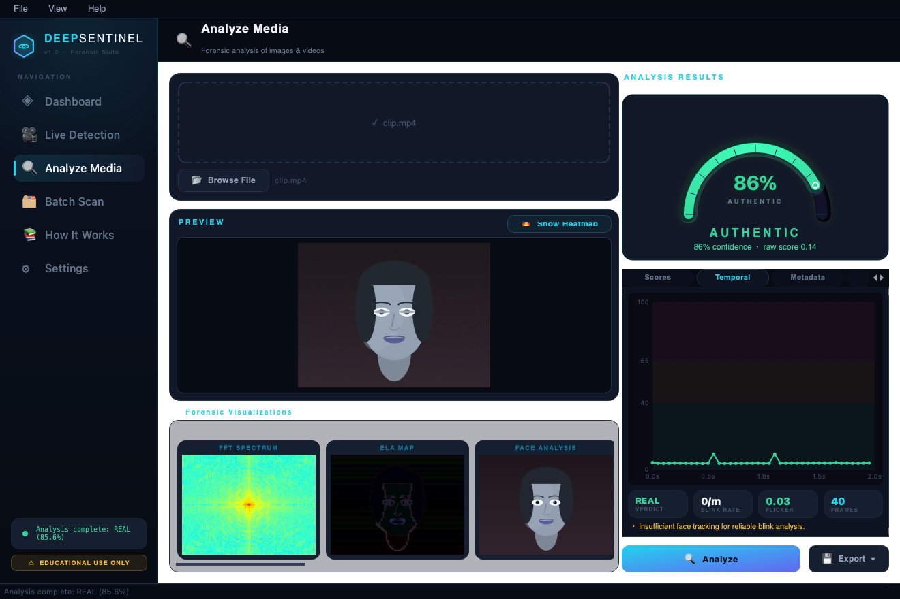
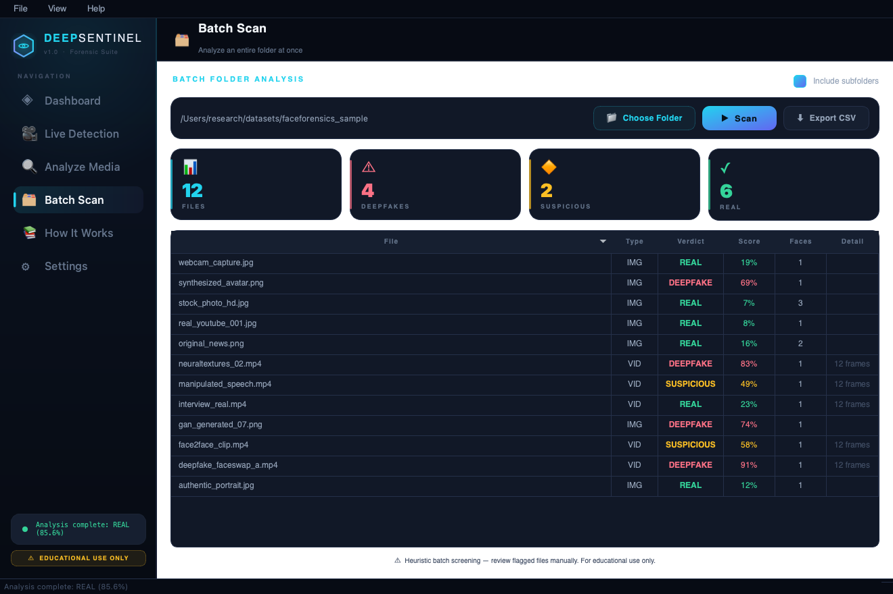
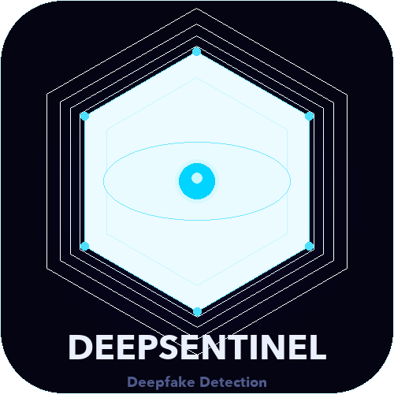

<div align="center">
  
</div>

<br/>

<div align="center">

[](https://python.org)
[](https://riverbankcomputing.com/software/pyqt/)
[](https://opencv.org)
[](LICENSE)
[](#installation)

<br/>

[](https://github.com/at0m-b0mb/DeepSentinel#ethics--legal)
[](https://github.com/at0m-b0mb/DeepSentinel/stargazers)
[](https://github.com/at0m-b0mb/DeepSentinel/issues)
[](https://github.com/at0m-b0mb/DeepSentinel/commits/main)

<br/>

**DeepSentinel** is an AI-powered deepfake detection and education platform.<br/>
Analyse webcam feeds and media files in real-time with multi-method forensic analysis —<br/>
and learn exactly how deepfakes work under the hood.

[**Getting Started**](#installation) · [**Screenshots**](#-screenshots) · [**Features**](#-features) · [**How It Works**](#-detection-methods) · [**Ethics**](#-ethics--legal)

</div>

---

## 📸 Screenshots

<table>
  <tr>
    <td align="center" width="50%">
      
      <br/>
      <sub><b>◈ Session Dashboard</b> — Live stats, analysis history &amp; quick actions</sub>
    </td>
    <td align="center" width="50%">
      
      <br/>
      <sub><b>🎥 Live Detection</b> — Real-time webcam analysis with animated arc gauge</sub>
    </td>
  </tr>
  <tr>
    <td align="center" width="50%">
      
      <br/>
      <sub><b>🔍 Analyze Media</b> — Forensics with the explainability <b>suspicion heatmap</b></sub>
    </td>
    <td align="center" width="50%">
      
      <br/>
      <sub><b>🎞 Video Temporal</b> — Per-frame timeline, blink-rate &amp; flicker scoring</sub>
    </td>
  </tr>
  <tr>
    <td align="center" width="50%">
      
      <br/>
      <sub><b>🗂 Batch Scan</b> — Analyze whole folders, sortable table, CSV export</sub>
    </td>
    <td align="center" width="50%">
      
      <br/>
      <sub><b>📚 How It Works</b> — Interactive education with the original algorithm</sub>
    </td>
  </tr>
</table>

<div align="center">
  
  <br/>
  <sub><b>⚙ Settings</b> — Configure methods, thresholds, MesoNet weights &amp; camera</sub>
</div>

---

## ✨ Features

<table>
  <tr>
    <td width="50%" valign="top">
      <h3>🎥 Live Webcam Detection</h3>
      <ul>
        <li><b>HD (720p) capture</b> with a sharp full-resolution overlay</li>
        <li>Clear verdicts — <b>"AUTHENTIC 92%"</b>, not a confusing "8%"</li>
        <li><b>Temporal smoothing</b> keeps the verdict from flickering</li>
        <li>Animated <b>arc confidence gauge</b> + live history graph</li>
        <li><b>Snapshot → Analyze</b>: freeze any frame for full forensics</li>
        <li>FPS counter, save-frame button, start/stop toggle</li>
      </ul>
    </td>
    <td width="50%" valign="top">
      <h3>🔍 Static Media Analysis</h3>
      <ul>
        <li>Drag-and-drop or browse <b>images &amp; videos</b></li>
        <li>Full multi-method pipeline with progress tracking</li>
        <li>Forensic <b>visualization strip</b>: FFT spectrum, ELA map, noise heatmap</li>
        <li><b>Explainability heatmap</b> — see <i>where</i> artifacts concentrate</li>
        <li><b>EXIF metadata panel</b> with AI-software flag detection</li>
        <li>Export <b>rich PDF / HTML / text</b> forensic reports</li>
      </ul>
    </td>
  </tr>
  <tr>
    <td width="50%" valign="top">
      <h3>🔥 Explainability Heatmap</h3>
      <ul>
        <li>Spatial <b>suspicion overlay</b> — cyan (clean) → red (suspect)</li>
        <li>Fuses ELA, texture-deficit &amp; noise residuals per tile</li>
        <li>Auto-marks the single hottest <b>hotspot</b> region</li>
        <li>Toggle between original and heatmap in one click</li>
        <li>Reports a <b>concentration score</b> (localized vs diffuse)</li>
      </ul>
    </td>
    <td width="50%" valign="top">
      <h3>🎞 Video Temporal Analysis</h3>
      <ul>
        <li><b>Per-frame score timeline</b> with threshold bands</li>
        <li><b>Blink-rate detection</b> — flags abnormally low rates</li>
        <li><b>Flicker scoring</b> — frame-to-frame identity shimmer</li>
        <li>Combines temporal + still-frame verdicts</li>
        <li>Peak-suspicion frame auto-selected for deep analysis</li>
      </ul>
    </td>
  </tr>
  <tr>
    <td width="50%" valign="top">
      <h3>🗂 Batch Folder Scan</h3>
      <ul>
        <li>Point at a folder — analyze <b>every image &amp; video</b></li>
        <li>Recursive subfolder traversal (optional)</li>
        <li><b>Sortable results table</b>: file, type, verdict, score, faces</li>
        <li>Live summary cards: total / fake / suspicious / real</li>
        <li><b>CSV export</b> of the full result set</li>
      </ul>
    </td>
    <td width="50%" valign="top">
      <h3>📄 Rich Report Export</h3>
      <ul>
        <li>Self-contained <b>HTML</b> &amp; <b>PDF</b> reports (no external assets)</li>
        <li>Embeds verdict, all scores &amp; forensic visualizations</li>
        <li>Includes heatmap, EXIF data &amp; temporal findings</li>
        <li>Shareable — opens in any browser / PDF viewer</li>
        <li>Always carries the educational-use disclaimer</li>
      </ul>
    </td>
  </tr>
  <tr>
    <td width="50%" valign="top">
      <h3>◈ Session Dashboard</h3>
      <ul>
        <li>Live stats: Files Analyzed, Deepfakes, Suspicious, Real</li>
        <li>Session timer with history log</li>
        <li>Recent analyses: timestamp, filename, verdict, score</li>
        <li>Quick-action buttons to jump between tabs</li>
        <li>System info: OpenCV, PyTorch, MPS/CUDA status</li>
      </ul>
    </td>
    <td width="50%" valign="top">
      <h3>📚 Education Tab</h3>
      <ul>
        <li>What are deepfakes? — history &amp; threat model</li>
        <li><b>The original 2017 algorithm</b> with simplified PyTorch code</li>
        <li>Modern methods: GANs, diffusion, real-time tools</li>
        <li>Detection science: how each method works</li>
        <li>Legal &amp; ethical context, legislation, resources</li>
      </ul>
    </td>
  </tr>
</table>

---

## 🧠 Detection Methods

| Method | Type | Live | Static | Notes |
|--------|------|:----:|:------:|-------|
| **FFT Frequency Analysis** | Signal / Forensic | ✓ | ✓ | GAN upsampling checkerboard artifacts in 2D spectrum |
| **Error Level Analysis** | Signal / Forensic | — | ✓ | JPEG re-compression mismatch at manipulation boundary |
| **Face Geometry** | Biometric | ✓ | ✓ | Haar cascade + eye placement vs anthropometric distributions |
| **SRM Noise Analysis** | Signal / Forensic | ✓ | ✓ | Sensor noise statistics; flags over-smooth or periodic residuals |
| **MesoNet (NN)** | Neural Network | ✓ | ✓ | 156K-param CNN from Afchar et al. 2018 — optional, needs PyTorch |

> **Accuracy note:** Heuristic methods achieve ~65–75% on moderate-quality deepfakes.
> State-of-the-art 2024 diffusion output can evade all current public detectors.
> Never use automated detection as the sole basis for a consequential decision.

---

## 🏗 Architecture

```
Input (frame / image / video / folder)
         │
         ├──▶  FFT Analysis       ── kurtosis + grid-periodicity score
         ├──▶  ELA Forensics      ── JPEG re-compression mismatch score
         ├──▶  Face Geometry      ── boundary artifact + eye-placement score
         ├──▶  SRM Noise          ── residual kurtosis + periodicity score
         └──▶  MesoNet (opt.)     ── CNN classification probability
                    │
                    ▼
           Weighted Ensemble ───────────────▶  🔥 Explainability Heatmap
                    │                            (where artifacts concentrate)
                    │
                    │   video? ──▶  🎞 Temporal Layer
                    │               (blink-rate · flicker · per-frame timeline)
                    ▼
         ┌──────────────────────────────┐
         │  score < 0.40  →  REAL       │
         │  0.40 – 0.65  →  SUSPICIOUS  │     ──▶  📄 PDF / HTML / CSV report
         │  score > 0.65  →  DEEPFAKE   │
         └──────────────────────────────┘
```

---

## 📁 Project Structure

```
DeepSentinel/
├── main.py                        # Entry point
├── requirements.txt
│
├── src/
│   ├── detection/
│   │   ├── detector.py            # Orchestrator — ensembles all method scores
│   │   ├── frequency_analysis.py  # FFT artifact + ELA forensics
│   │   ├── face_analyzer.py       # Haar cascade + geometry + boundary checks
│   │   ├── noise_analyzer.py      # SRM high-pass noise residual analysis
│   │   ├── mesonet.py             # MesoNet Meso4 (PyTorch, optional)
│   │   ├── metadata.py            # EXIF extraction + AI-software flag detection
│   │   ├── heatmap.py             # Explainability suspicion heatmap (ELA+texture+noise)
│   │   ├── temporal.py            # Video temporal forensics — blink + flicker
│   │   └── report.py             # Rich HTML / PDF report generation
│   │
│   ├── education/
│   │   └── pipeline.py            # HTML content for the How It Works tab
│   │
│   └── gui/
│       ├── theme.py               # Dark cyberpunk QSS stylesheet + palette
│       ├── widgets.py             # ConfidenceDial · HistoryGraph · TimelineGraph
│       │                          #   GlowScoreBar · StatCard · PulsingDot
│       ├── main_window.py         # Sidebar app-shell · NavSidebar · TopBar · pages
│       ├── dashboard_tab.py       # Session stats + history + quick actions
│       ├── live_tab.py            # Webcam feed + CameraWorker QThread
│       ├── analyze_tab.py         # Static analysis + heatmap + temporal + EXIF
│       ├── batch_tab.py           # Batch folder scan + results table + CSV
│       ├── education_tab.py       # Sidebar nav + rich-HTML content + code panel
│       └── settings_tab.py        # Method toggles · thresholds · MesoNet loader
│
├── tools/
│   └── make_screenshots.py        # Renders GUI tabs to PNG for the README
│
└── assets/
    ├── banner.png                 # 1280×640 hero banner
    ├── logo.png                   # 500×500 square icon
    └── screenshots/               # Tab screenshots for README
```

---

## 🚀 Installation

### Prerequisites
- Python **3.11+**
- macOS · Linux · Windows

### Clone & Install

```bash
git clone https://github.com/at0m-b0mb/DeepSentinel.git
cd DeepSentinel
pip install -r requirements.txt
```

### Run

```bash
python main.py
```

### Optional — MesoNet Neural Network

**Easiest:** open **Settings → MesoNet** and click **⬇ Install PyTorch (one-click)**.
It installs `torch` + `torchvision` in the background with a live log, then prompts a restart.

Prefer the command line?

```bash
# Install PyTorch (Apple Silicon / MPS or CPU)
pip install torch torchvision

# Install PyTorch (CUDA GPU)
pip install torch torchvision --index-url https://download.pytorch.org/whl/cu121

# Pretrained Meso4 weights: Settings → MesoNet → "Get weights ↗" → Browse
```

---

## ⚖ Ethics & Legal

> **This project is for educational, research, and defensive security use only.**

Creating non-consensual deepfakes is **illegal** under:

| Jurisdiction | Legislation |
|---|---|
| 🇬🇧 United Kingdom | Online Safety Act 2023 — up to 2 years imprisonment |
| 🇺🇸 United States | DEFIANCE Act 2024 — federal civil claims; state criminal statutes |
| 🇪🇺 European Union | AI Act 2024 — mandatory watermarking, heavy fines |
| 🇨🇳 China | Synthetic Content Regulations 2022 — mandatory labelling + consent |

**Legitimate use cases:** Security R&D · Journalism fact-checking · Digital forensics · Academic research · Media literacy education

By using DeepSentinel you confirm you will act ethically, legally, and within the scope of legitimate research or defensive security.

---

## 📖 References

- Afchar et al. (2018) — *MesoNet: a Compact Facial Video Forgery Detection Network* · [arXiv:1809.00888](https://arxiv.org/abs/1809.00888)
- Rössler et al. (2019) — *FaceForensics++: Learning to Detect Manipulated Facial Images* · [arXiv:1901.08971](https://arxiv.org/abs/1901.08971)
- Fridrich & Kodovský (2012) — *Rich Models for Steganalysis of Digital Images*
- Li et al. (2020) — *SimSwap: An Efficient Framework For High Fidelity Face Swapping*
- Güera & Delp (2018) — *Deepfake Video Detection Using Recurrent Neural Networks*

---

<div align="center">



<br/>

Made by **[at0m-b0mb](https://github.com/at0m-b0mb)**

<br/>

*"See through the synthetic."*

</div>
